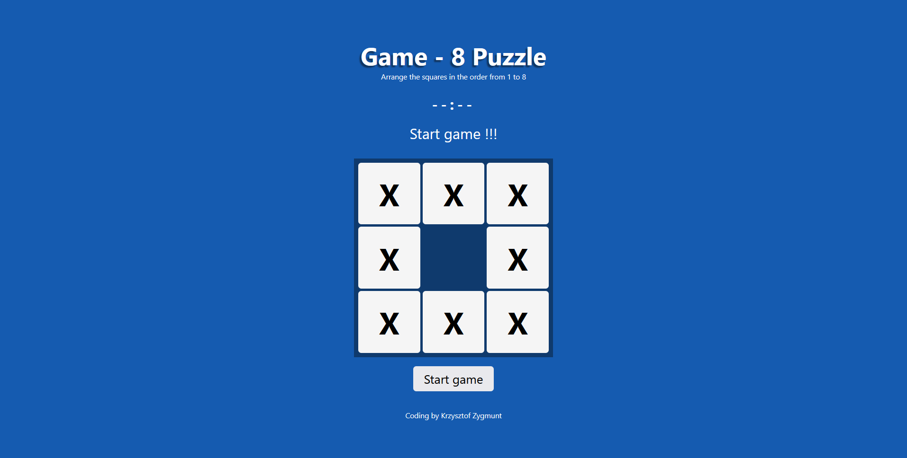

    <h1>Sliding Puzzle</h1>
    <h3>
        <a href="https://chrisonoo.github.io/SlidingPuzzle/">
            Live Demo
        </a>
         | 
        <a href="https://github.com/chrisonoo/SlidingPuzzle">
            GitHub
        </a>
    </h3>
    
 Simple manager for handling a list of books

    
<b>Status:</b> Project completed

     
    
Technologies and tools:

    

        
        
        
        
        
        
        
    

 

## Description

Welcome to the classic logic game "Sliding Puzzle" that has fascinated millions of players around the world! Your task is to move numbers on a board, aiming to arrange them in numerical order. This game, seemingly simple at first glance, is a real challenge that can provide hours of satisfaction.

In addition, you'll be timing yourself - can you beat the 14-second record set by the author of this description? Start playing, discover techniques to improve your results, and experience the emotions associated with solving puzzles in this captivating logic game!

## Result

  

## About Me

Hello, I'm Krzysztof, but feel free to call me Chris. I'm a budding full-stack programmer with a special focus on **.NET** and **SQL**. Passionate about problem-solving, I enjoy crafting efficient **backend** and **frontend** solutions.

As an emerging software developer, I'm keen to apply my knowledge and skills in a professional setting. I'm excited to bring my life and professional experience, providing a unique perspective to software development tasks. Eager to commence my journey in the industry, I am **actively seeking employment opportunities** where I can continue to grow and create.

Check out my [Portfolio](https://onoo.no/portfolio) or connect with me on [LinkedIn](https://www.linkedin.com/in/k-p-z/).

[
 
](https://onoo.no/portfolio)